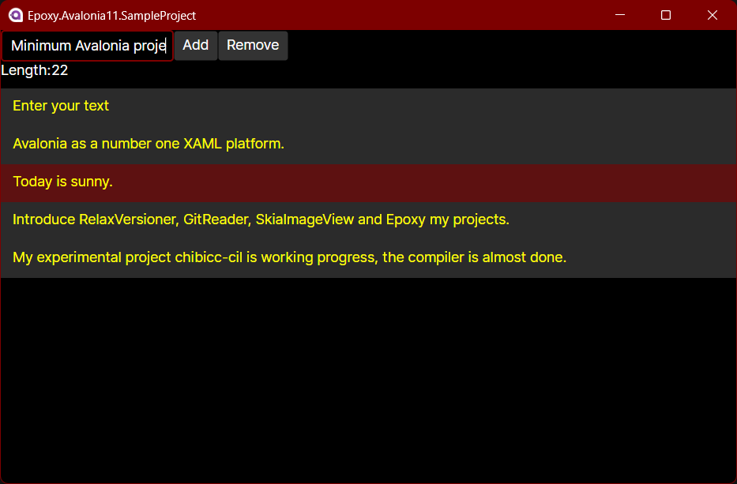

# Step-by-step Epoxy Avalonia 11 sample project.

## What is this?

This repository is a sample project that creates an Avalonia 11 ToDo list like project and applies Epoxy.
It looks shabby, but this is due to the elimination of as much extraneous implementation
that is not related to the MVVM structure as possible.

* When you type characters in the text box, the current number of characters is reflected in the `length:`.
* Clicking the `Add` button adds the string entered in the text box to the list box below.
* Selecting any line from the list box activates the `Remove` button. Clicking the `Remove` button removes the line.

It is applied a little bit at each commit, so you can use it as a reference
if you want to use Epoxy in a full-scratch project.

## In japanese

このリポジトリは、Avalonia 11でToDoリストのようなプロジェクトを作り、Epoxyを適用するプロジェクトのサンプルです。
見た目がショボいですが、これはMVVM構造に関係のない余計な実装を極力排除したためです。

* テキストボックスに文字を入力すると、現在の文字数が `length:` に反映されます。
* `Add` ボタンをクリックすると、テキストボックスに入力した文字列が、下のリストボックスに追加されます。
* リストボックスから任意の行を選択すると `Remove` ボタンが有効化されます。`Remove` ボタンをクリックすると、その行が削除されます。

コミット毎に少しずつ適用しているので、フルスクラッチでEpoxyを使いたい場合の参考にしてください。

## License

CC0
